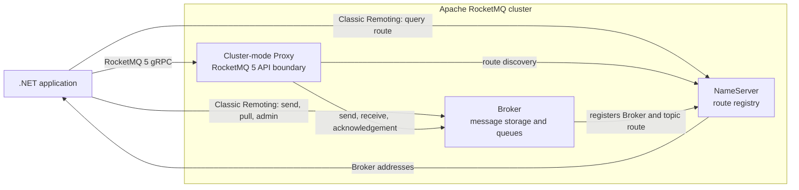
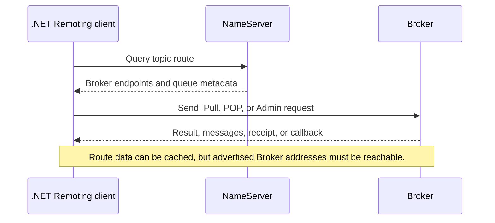
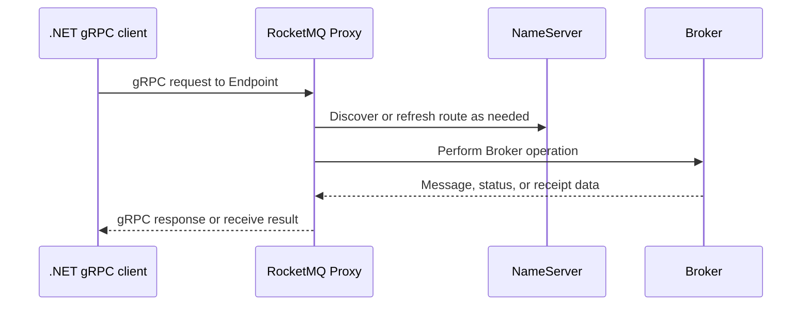
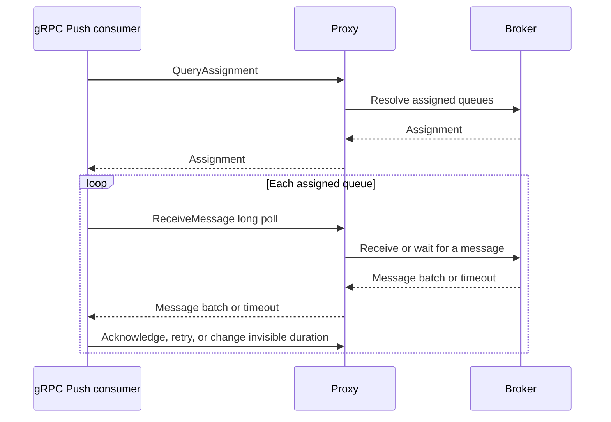
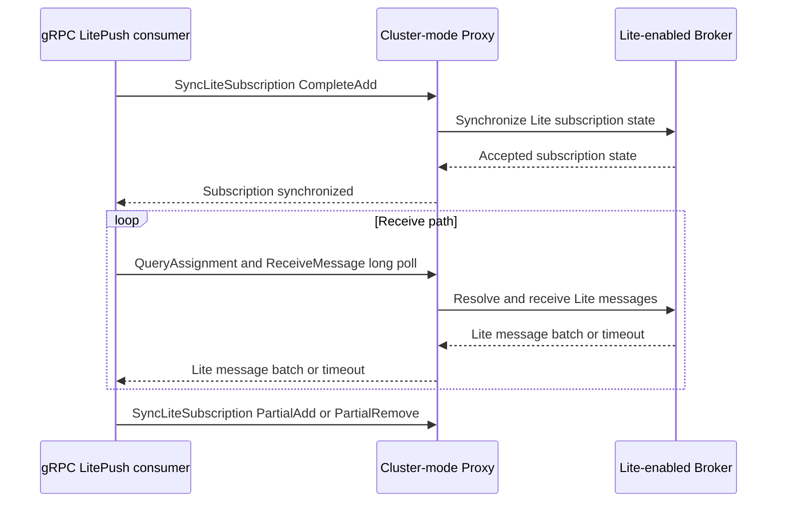
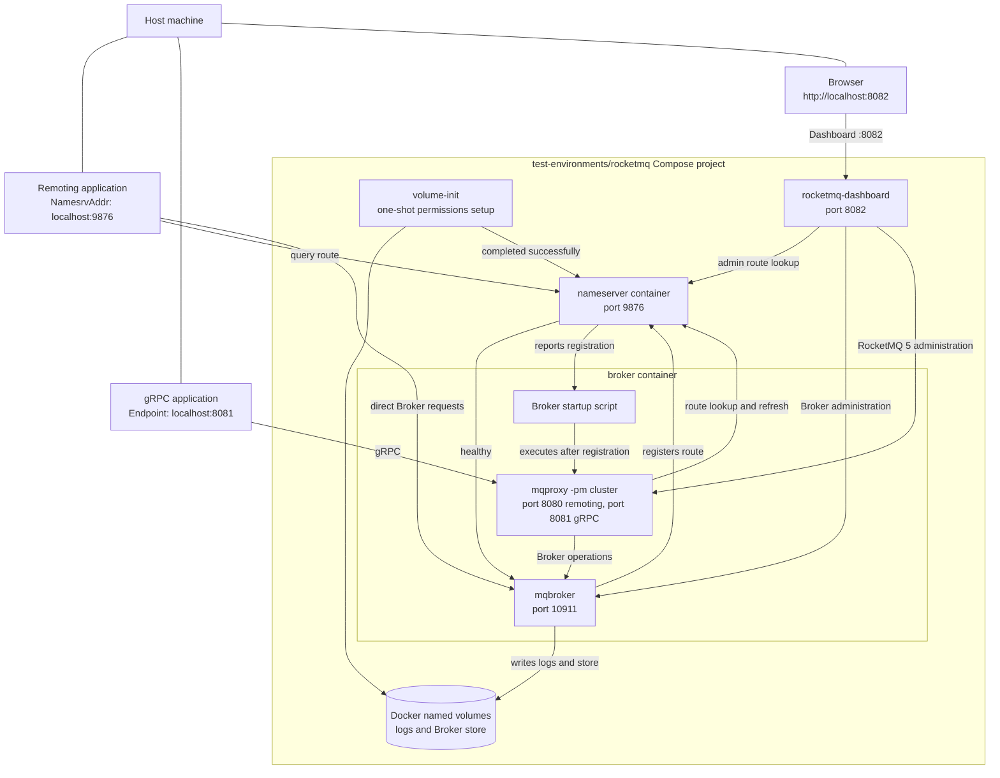

# RocketMQ Architecture: NameServer, Broker, Proxy, and Client Paths

[English](rocketmq-architecture.md) | [Simplified Chinese](../../zh-CN/architecture/rocketmq-architecture.md)

Apache RocketMQ is not a single server endpoint. The address an application uses depends on its
protocol: classic Remoting discovers Brokers through a NameServer, while a RocketMQ 5 gRPC client
connects to a Proxy. This repository supports both paths, so component responsibilities must be
understood before choosing a client API, configuring a network policy, or investigating a failure.

> This article describes the RocketMQ components used by this client and the bundled local
> environment. It is not a production-cluster operations guide. Replication, storage, security,
> monitoring, and availability must be designed for the deployed RocketMQ version and topology.

## Components and Responsibilities

| Component | Stores or owns | Does not do | How this client uses it |
| --- | --- | --- | --- |
| **NameServer** | Broker registration and topic routes. It answers which Broker serves a topic. | Store application messages or forward classic client data-plane commands. | Remoting connects through `NamesrvAddr`, obtains a route, then connects to the Broker. |
| **Broker** | Message storage, topics and queues, consumer-group state, retry/dead-letter behavior, transactions, and most server-side message semantics. | Serve as the public gRPC endpoint for every feature; behavior remains version- and configuration-dependent. | Remoting connects directly; Proxy collaborates with it for gRPC operations. |
| **Cluster-mode Proxy** | The RocketMQ 5 Proxy service boundary, gRPC APIs, route handling, and coordination of Broker requests. | Give gRPC every classic queue, offset, or callback semantic automatically. | gRPC connects through `Endpoint`, not to a NameServer or direct Broker address. |
| **.NET client** | Protocol-specific APIs, connections, retries, message dispatch, and DI lifetimes. | Supply a missing Proxy or Broker RPC through an SDK setting. | The application explicitly registers `AddRocketMQGrpc` or `AddRocketMQRemoting`. |

NameServers can have multiple instances and Brokers can use cluster, primary/replica, or other
availability arrangements. The diagram deliberately shows logical relationships; the one-Broker
Compose environment is not a production topology recommendation.

## Two Client Paths

### Classic Remoting: NameServer Discovery, Direct Broker Connection

`NamesrvAddr` is a route-query endpoint, not the endpoint that receives messages. The classic
client retrieves a target topic's route, then opens a TCP connection to the corresponding Broker.
Sending, pulling, POP, classic Push, Admin operations, and Broker callbacks remain on this
protocol path.

This creates a direct deployment requirement: every Broker address returned by the NameServer must
be reachable from the application's network. Allowing access to the NameServer while blocking the
Broker ports produces a successful route query followed by failed message operations. Containers,
NAT, cross-VPC routing, TLS/SNI, and a mismatched `brokerIP1` often exhibit this pattern.

`EventHorizon.RocketMQ.Remoting` uses `NamesrvAddr` and refreshes routes with its built-in
[`TopicRouteService`](../../../src/EventHorizon.RocketMQ.Remoting/Protocol/Route/TopicRouteService.cs). See
[Classic Remoting transport and client roles](../remoting/transport-and-client-roles.md) for the
client-side transport details.

### RocketMQ 5 gRPC: The Client Connects to Proxy

The gRPC `Endpoint` identifies a Proxy. The Proxy exposes the RocketMQ 5 gRPC services and
coordinates with route metadata and Brokers; an application does not use the gRPC API to query a
NameServer, and must not put a NameServer address in `Endpoint`.

This is not a semantically empty TCP relay. The Proxy's RPC set and behavior are a server-side
capability boundary. A matching protobuf declaration does not prove that a target Proxy implements
the operation. This repository exposes the gRPC consumer models it supports: Simple, Push, and
LitePush. It deliberately does not expose a gRPC Pull API that would depend on unavailable Proxy
behavior.

`EventHorizon.RocketMQ.Grpc` connects through `Endpoint`. Its result types, options, and Consumer
APIs intentionally remain separate from Remoting; see [protocol boundaries and
dependencies](protocol-boundaries.md).

## Push Does Not Mean Broker-Initiated Connections

Both gRPC Push/LitePush and classic Remoting Push are built on pull or long-poll mechanisms. For
gRPC Push, the background Consumer queries assignments and repeatedly calls `ReceiveMessage`; the
Proxy and Broker return messages only for a request that is already in progress.

The application model is automatic handler dispatch, but the network model remains
client-initiated long polling. Connection lifetime, long-poll timeout, cancellation, local caching,
and handler concurrency remain client concerns. A process exit, network interruption, or failed
acknowledgement can still result in at-least-once delivery, so handlers must be idempotent. See the
[gRPC consumer model](../grpc/consumer-model.md) for scheduling and acknowledgement behavior.

## LitePush: An Additional Subscription Control Plane

LitePush is a LiteTopic variant of gRPC Push. It is neither server push nor another name for gRPC
Pull. In addition to the normal Push assignment query and `ReceiveMessage` long polls, it calls
`SyncLiteSubscription` at startup, after subscription changes, and during periodic reconciliation.

The RPC is a control-plane operation. The client provides the consumer group, bind topic, LiteTopic
set, and optionally an initial offset policy so the Proxy can serve the Lite receive path. Receiving
messages still follows the client-initiated long-poll path.

LitePush requires all of the following server-side preparation:

- `enableLmq=true` and `enableMultiDispatch=true` on every Broker storing the LITE parent topic.
- A parent topic created with `message.type=LITE`.
- A consumer group with `lite.bind.topic=<parent-topic>`.
- A Proxy implementation of `SyncLiteSubscription`.

In RocketMQ 5.5.0, the local Broker-integrated Proxy started with `mqbroker --enable-proxy` does
not implement this RPC. Use `mqproxy -pm cluster` or a compatible newer Proxy. This limitation does
not affect the standard gRPC Producer, SimpleConsumer, or PushConsumer, but it prevents LitePush
startup and runtime Lite subscription changes. The [LitePush sample](../../../samples/grpc/GenericHost/LitePushConsumer/README.md)
has the executable configuration steps.

## Local Compose Environments

[`test-environments/rocketmq`](../../../test-environments/rocketmq) is a single-Broker environment
for manual verification, not a production cluster template. It uses the Apache RocketMQ 5.5.0 image,
starts a NameServer, Broker, cluster-mode Proxy, and RocketMQ Dashboard, and binds all published ports to
`127.0.0.1`.

Use [`rocketmq-litepush`](../../../test-environments/rocketmq-litepush) for the repository's LitePush sample. Its Compose
startup automatically creates the sample's LITE parent topic and consumer group.

Use [`rocketmq-multi-broker`](../../../test-environments/rocketmq-multi-broker) to inspect three-Broker route and
partitioning behavior. It contains independent masters, not a replication topology.

`volume-init` is a one-shot initialization service. It creates log and store directories in Docker
named volumes and gives them to the image's non-root `rocketmq` user. It exits before the NameServer
and Broker start, preventing a first-mount permissions mismatch from stopping logs or message storage.

The Broker and Proxy share one Compose service but run as distinct, ordered processes. The Broker
registers with the NameServer first; the startup script confirms the registration before it starts
`mqproxy -pm cluster`. This preserves the fixed Broker address the NameServer advertises to local
Remoting clients while also providing the cluster-mode Proxy needed by LitePush.

Dashboard is a separate container that shares the Broker network namespace. It can therefore use the same fixed
`127.0.0.1:10911` route that host Remoting clients receive. It listens on `8082` instead of the Proxy's remoting
port, and is intentionally bound only to the local host.

Common local endpoints are:

| Path | Client configuration | Local endpoint |
| --- | --- | --- |
| Classic Remoting | `NamesrvAddr` | `localhost:9876`, followed by the `localhost:10911` Broker route returned by the NameServer. |
| RocketMQ 5 gRPC | `Endpoint` | `localhost:8081`. |
| Proxy remoting port | Not the entry point for this repository's classic Remoting client | `localhost:8080`; retained for the Proxy's remoting service. |
| RocketMQ Dashboard | Browser | `http://localhost:8082`; a local management interface that can modify cluster resources. |

The Compose `brokerIP1=127.0.0.1` and fixed Broker port are specifically for local host testing.
Do not copy that configuration directly to a containerized production application or cross-host
cluster: production Brokers must advertise addresses that are routable from every real client
network. See the [local RocketMQ environment guide](../../../test-environments/rocketmq/README.md)
for startup, persistence, and Lite parent-topic commands.

## Troubleshooting Order

When sending or receiving fails, troubleshooting the actual protocol path is more useful than only
checking whether RocketMQ is running:

1. **Confirm the connection target.** Remoting configures a NameServer; gRPC configures a Proxy gRPC endpoint.
2. **Confirm route reachability.** After a Remoting NameServer query succeeds, verify every returned Broker address is reachable from the application network.
3. **Confirm Proxy mode.** LitePush requires a cluster-mode Proxy that implements `SyncLiteSubscription`; enabling only the Broker-integrated Proxy is insufficient.
4. **Confirm Lite server preparation.** Check the parent topic, consumer-group bind topic, and the Broker LMQ/multi-dispatch settings.
5. **Confirm the receive model.** An empty Push/LitePush result can be a long-poll timeout or temporary lack of assignment; it is not evidence that the server should initiate a connection back to the application.

## Related Reading

- [Protocol Boundaries and Type Ownership](protocol-boundaries.md)
- [Dependency-injection client registrations and lifetimes](dependency-injection-and-lifetimes.md)
- [gRPC consumer model](../grpc/consumer-model.md)
- [Classic Remoting transport and client roles](../remoting/transport-and-client-roles.md)
- [Local and integration testing](../testing/local-and-integration-testing.md)
- [Local RocketMQ environment](../../../test-environments/rocketmq/README.md)
