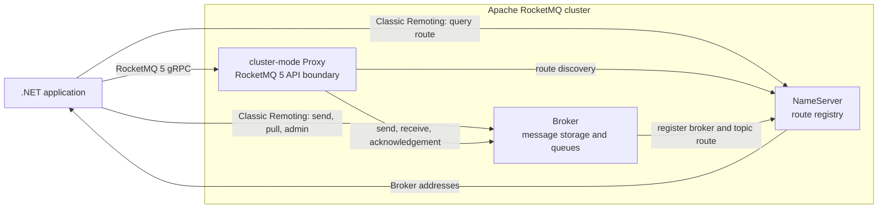
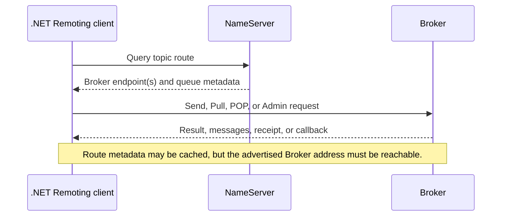
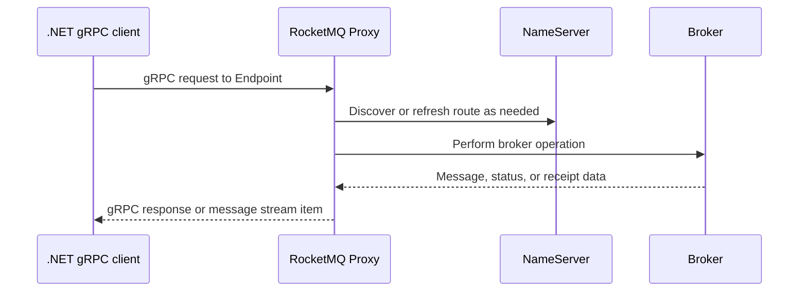
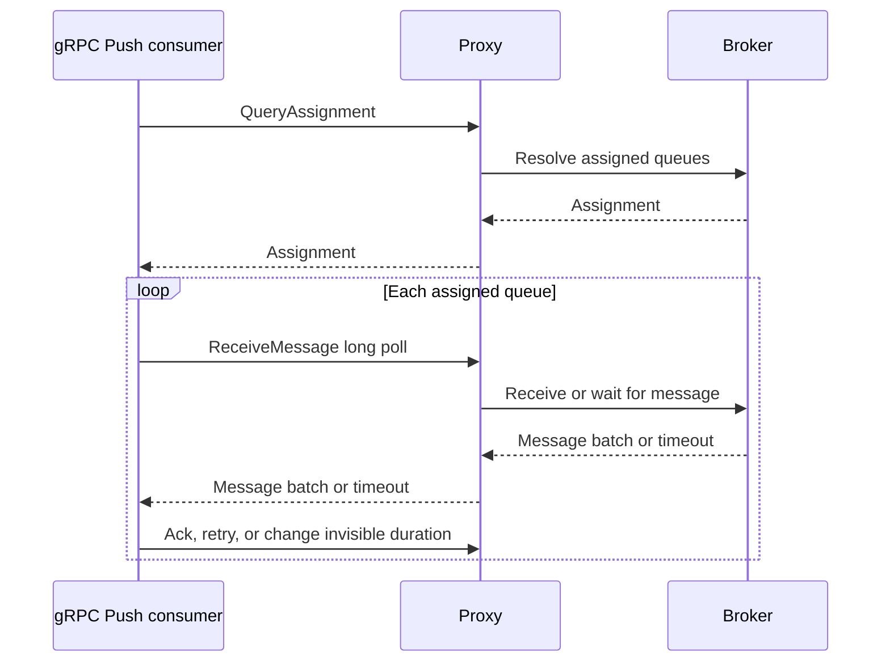
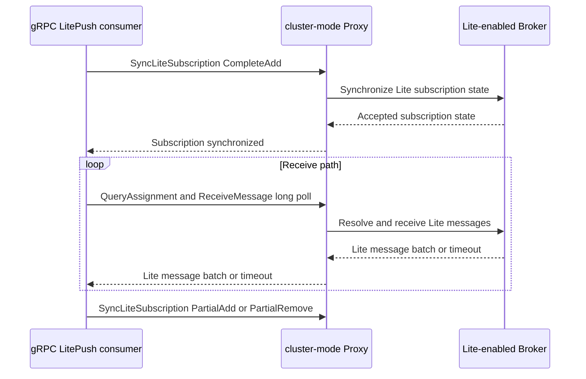
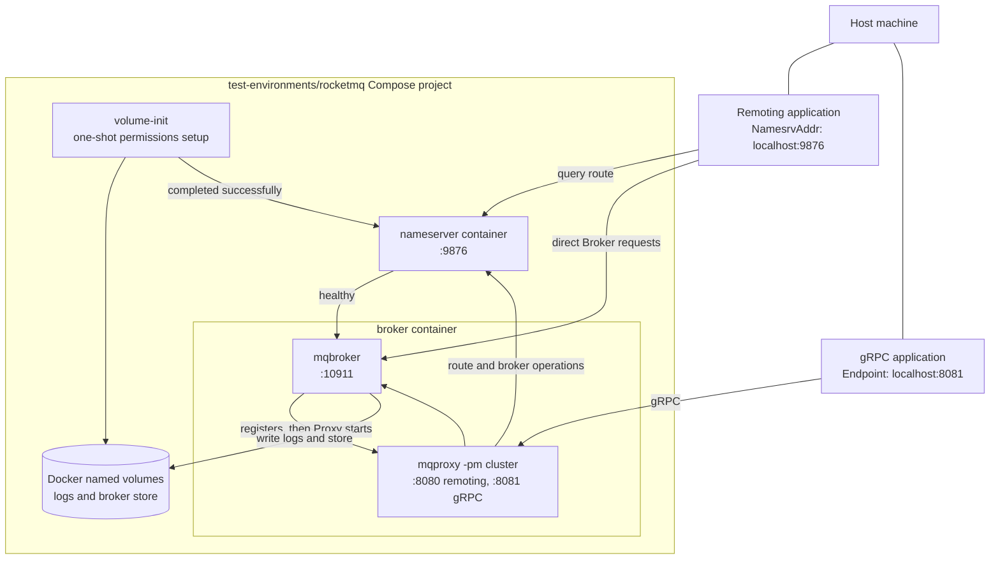

# RocketMQ 架构：NameServer、Broker、Proxy 与两条客户端路径

[English](../../en-US/architecture/rocketmq-architecture.md) | [简体中文](rocketmq-architecture.md)

Apache RocketMQ 的服务端不是一个单一端点。应用看到的连接地址取决于所选协议：经典 Remoting 先通过
NameServer 发现 Broker，而 RocketMQ 5 gRPC 客户端连接 Proxy。本项目同时支持这两条路径，因此在部署、
网络策略和故障排查时，先分清各组件的职责比先看客户端 API 更重要。

> 本文描述本客户端实际使用的 RocketMQ 组件和随附的本地环境。它不是 RocketMQ 集群运维手册；生产集群的
> 副本数、主从拓扑、存储策略、认证和可观测性仍应按自身的 RocketMQ 版本与运维规范设计。

## 组件与职责

| 组件 | 保存或负责什么 | 不负责什么 | 本客户端如何使用 |
| --- | --- | --- | --- |
| **NameServer** | Broker 注册信息与 topic route。它回答“某个 topic 的 Broker 在哪里”。 | 不承载消息正文，也不替客户端转发经典消息请求。 | Remoting 客户端以 `NamesrvAddr` 连接它，获取 route 后直连 Broker。 |
| **Broker** | 消息存储、Topic/队列、消费进度、重试/死信、事务与大部分服务端消息语义。 | 不等同于 gRPC 的公开入口；具体特性还受版本和配置约束。 | Remoting 客户端直接访问；Proxy 也代表 gRPC 客户端与它协作。 |
| **cluster-mode Proxy** | RocketMQ 5 的 Proxy 服务边界、gRPC API、路由与对 Broker 的请求协调。 | 不会让 gRPC 自动拥有经典协议的全部 queue/offset/callback 语义。 | gRPC 客户端以 `Endpoint` 连接它，而不是连接 NameServer 或 Broker。 |
| **.NET 客户端** | 协议专用 API、连接、重试、消息处理和 DI 生命周期。 | 不能用 SDK 配置补齐缺失的 Proxy/Broker RPC。 | 显式注册 `AddRocketMQGrpc` 或 `AddRocketMQRemoting`。 |

NameServer 可以有多个实例，Broker 也可以按集群、主从或副本策略部署。下图刻意画出逻辑关系，而不把
单机 Compose 环境误认为生产推荐拓扑。

## 两条客户端路径

### 经典 Remoting：NameServer 发现，Broker 直连

经典 Remoting 的 `NamesrvAddr` 不是消息收发端点，而是 route 查询入口。客户端先获取目标 topic 的 route，
再向其中的 Broker 建立 TCP 连接。发送、拉取、POP、经典 Push、Admin 查询及 Broker 回调均保留在这条
协议路径中。

这带来一个直接的部署要求：从应用所在网络看，NameServer 返回的 Broker 地址必须真实可达。只允许应用
访问 NameServer 而阻断 Broker 端口，会使 route 查询成功但实际消息请求失败。容器、NAT、跨 VPC、TLS SNI
和 `brokerIP1` 的配置不一致，都常表现为这种“发现成功、连接失败”的问题。

本项目的 `EventHorizon.RocketMQ.Remoting` 使用 `NamesrvAddr`，并由内置的
[`TopicRouteService`](../../../src/EventHorizon.RocketMQ.Remoting/Protocol/Route/TopicRouteService.cs) 缓存和刷新
route。详见[经典 Remoting：传输、路由与客户端角色](../remoting/transport-and-client-roles.md)。

### RocketMQ 5 gRPC：客户端连接 Proxy

gRPC 的 `Endpoint` 指向 Proxy。Proxy 负责暴露 RocketMQ 5 的 gRPC 服务，并根据服务端 route 与 Broker
协作；应用不直接用 gRPC API 查询 NameServer，也不应把 NameServer 地址填到 `Endpoint` 中。

这不是一层无语义的 TCP 转发：Proxy 提供的 RPC 集合与行为是服务端能力边界。因此，客户端有对应的 protobuf
声明不代表目标 Proxy 一定实现了该功能。项目只公开已选择并验证过的 gRPC consumer 模型：Simple、Push 与
LitePush；显式 queue/offset 的 gRPC Pull 没有公开 API。

`EventHorizon.RocketMQ.Grpc` 以 `Endpoint` 连接 Proxy。它与 Remoting 有意维持独立的结果、状态、选项和
Consumer API；选择关系与包边界见[协议边界](protocol-boundaries.md)。

## Push 并不表示 Broker 主动连接应用

无论是 gRPC Push/LitePush，还是经典 Remoting Push，客户端都以拉取或长轮询作为核心接收机制。对 gRPC
Push 而言，后台 Consumer 先查询分配，再由客户端主动重复调用 `ReceiveMessage`；Proxy 和 Broker 仅在
请求存在时返回消息或在长轮询超时后返回。

这意味着网络连接、长轮询超时、取消、本地缓存和 handler 并发仍由客户端侧管理。发生进程退出、网络中断或
确认失败时，至少一次交付仍可能产生重复消息，业务 handler 必须保持幂等。更详细的确认与调度模型见
[gRPC 消费模型](../grpc/consumer-model.md)。

## LitePush：额外的订阅控制面

LitePush 是 gRPC Push 的 LiteTopic 变体，不是“更换为服务端推送”或“开启 gRPC Pull”。除普通 Push 的
分配查询和 `ReceiveMessage` 长轮询外，它还需要在启动、订阅变化和定期同步时调用
`SyncLiteSubscription`。

该 RPC 是控制面操作：客户端向 Proxy 同步 consumer group、bind topic、LiteTopic 集合以及可选的起始
offset 选项。它让 Proxy 知道某个 Lite 消费组当前订阅了什么；真正接收消息仍沿用客户端发起的长轮询。

LitePush 的服务端前提包括：

- Broker 启用 `enableLmq=true` 和 `enableMultiDispatch=true`；
- parent topic 以 `message.type=LITE` 创建；
- consumer group 设置 `lite.bind.topic=<parent-topic>`；
- Proxy 实现 `SyncLiteSubscription`。

对于 RocketMQ 5.5.0，`mqbroker --enable-proxy` 启动的 Broker 内嵌 local Proxy 没有实现这条 RPC；需要运行
`mqproxy -pm cluster` 或部署兼容的新版 Proxy。这个限制不会影响标准 gRPC Producer、SimpleConsumer 或
PushConsumer，但会使 LitePush 启动或运行时 Lite 订阅变更失败。可执行的配置示例见
[LitePush sample](../../../samples/grpc/LitePushConsumer/README.zh-CN.md)。

## 随附 Compose 环境

[`test-environments/rocketmq`](../../../test-environments/rocketmq) 是用于手动验证的单 Broker 本地环境，
不是生产集群模板。它使用 Apache RocketMQ 5.5.0 镜像，启动 NameServer、Broker 和 cluster-mode Proxy，
并把所有公开端口绑定到 `127.0.0.1`。

其中 `volume-init` 是一次性初始化服务。它先创建 Docker named volume 中的日志与存储目录，并把目录所有权
交给镜像中的非 root `rocketmq` 用户；随后退出，NameServer 和 Broker 才启动。这避免本地 Docker volume
在首次挂载时因权限不匹配而使服务无法写日志或消息存储。

Broker 和 Proxy 在同一 Compose service 中，但它们是两个按顺序启动的独立进程。Broker 先注册到
NameServer；脚本确认注册成功后才 `exec` 启动 `mqproxy -pm cluster`。这样既保留 NameServer 向宿主机
Remoting 客户端通告的固定 Broker 地址，也提供 LitePush 所需的 cluster-mode Proxy 服务。

本地环境的常用端点如下：

| 路径 | 客户端配置 | 本地端点 |
| --- | --- | --- |
| 经典 Remoting | `NamesrvAddr` | `localhost:9876`，随后 NameServer 返回 `localhost:10911` 的 Broker route。 |
| RocketMQ 5 gRPC | `Endpoint` | `localhost:8081`。 |
| Proxy Remoting 端口 | 不用于本项目的经典 Remoting 客户端入口 | `localhost:8080`，保留给 Proxy 的 Remoting 服务。 |

Compose 的 `brokerIP1=127.0.0.1` 和固定 Broker 端口专为宿主机本地测试设计。不要直接把这组配置复制到
容器化生产应用或跨主机集群：生产 Broker 必须向每个实际客户端网络通告可路由的地址。启动、持久化和手工
创建 Lite parent topic 的具体命令见[本地 RocketMQ 环境说明](../../../test-environments/rocketmq/README.md)。

## 故障排查顺序

当发送或消费失败时，按协议路径而不是按“RocketMQ 是否启动”这个笼统问题排查更有效：

1. **确认连接目标。** Remoting 应配置 NameServer；gRPC 应配置 Proxy 的 gRPC endpoint。
2. **确认 route 可达。** Remoting 的 NameServer 查询成功后，检查它返回的每个 Broker 地址是否能从应用网络连接。
3. **确认 Proxy 模式。** LitePush 必须是实现 `SyncLiteSubscription` 的 cluster-mode Proxy，不能只启用 Broker
   内嵌 Proxy。
4. **确认 Lite 服务端准备。** 检查 parent topic、consumer group bind topic 和 Broker 的 LMQ/multi-dispatch
   开关。
5. **确认接收模型。** Push/LitePush 的空结果可能只是长轮询超时或暂时没有分配；不要将其误判为服务端应主动
   回连应用的故障。

## 延伸阅读

- [协议边界](protocol-boundaries.md)
- [依赖注入与生命周期](dependency-injection-and-lifetimes.md)
- [gRPC 消费模型](../grpc/consumer-model.md)
- [经典 Remoting：传输、路由与客户端角色](../remoting/transport-and-client-roles.md)
- [本地与集成测试](../testing/local-and-integration-testing.md)
- [本地 RocketMQ 环境说明](../../../test-environments/rocketmq/README.md)
