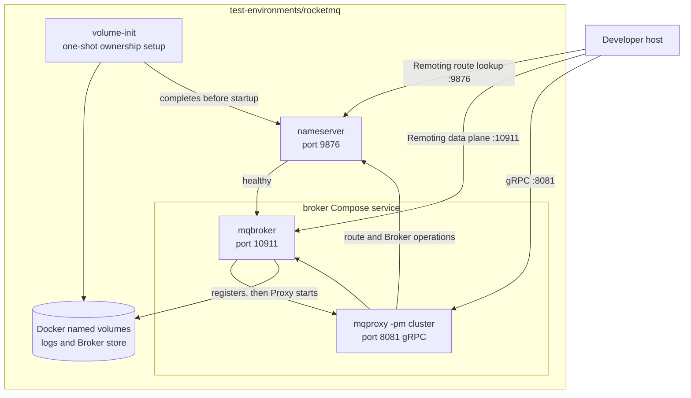

# Test Environments

[English](README.md) | [简体中文](README.zh-CN.md)

This directory groups Docker Compose environments for manual local testing. Each immediate child is a self-contained
environment with its own Compose files, configuration, and setup guide. Add a new environment as a new child directory
rather than mixing unrelated services into an existing stack.

## Current Topology

The current `rocketmq` environment is a LitePush-capable single-Broker development stack. Broker
and Proxy are separate processes inside the `broker` Compose service; this is intentionally not the
Broker-integrated Proxy mode.

| Environment | Purpose | Guide |
| --- | --- | --- |
| [`rocketmq`](rocketmq) | Local Apache RocketMQ 5.5.0 NameServer, Broker, and separately started cluster-mode Proxy for samples and manual client testing. This is the bundled LitePush-capable stack. | [README](rocketmq/README.md) |

Integration tests use Testcontainers and do not require one of these environments to be running.
