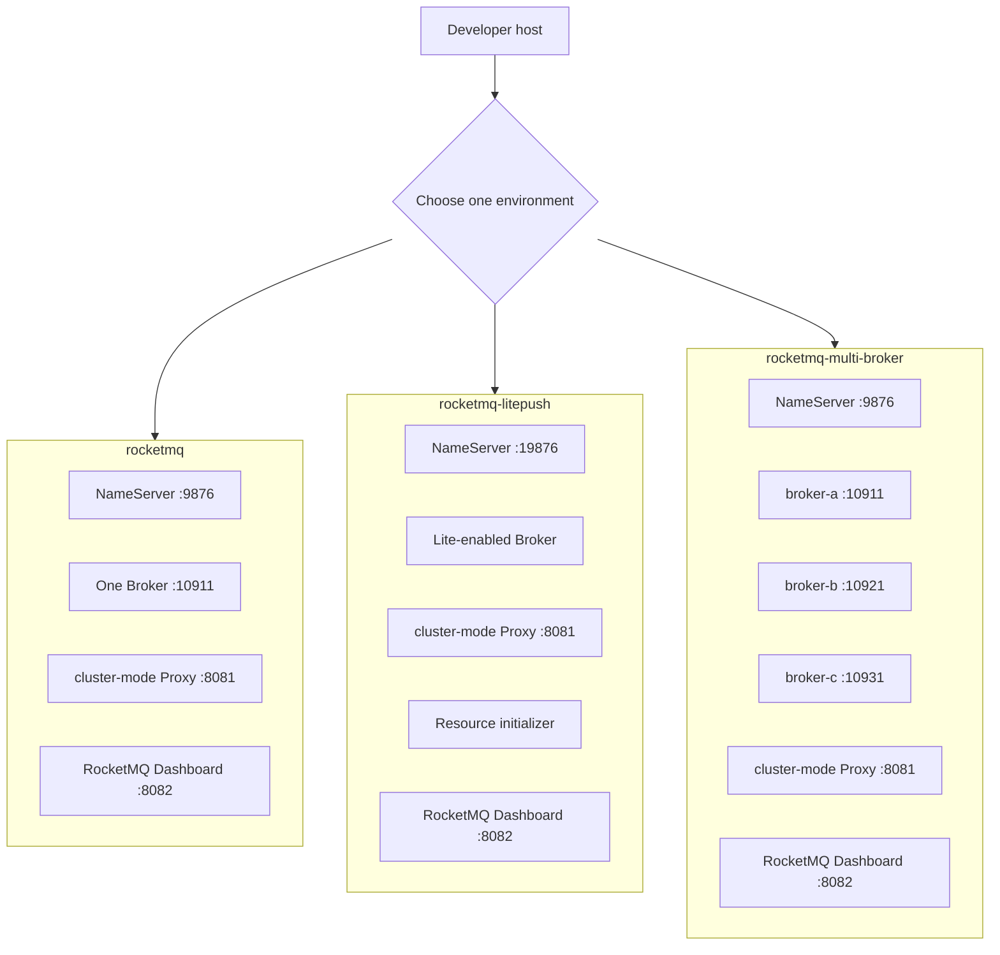

# Test Environments

[English](README.md) | [简体中文](README.zh-CN.md)

This directory contains Docker Compose environments for manual local testing. They are development and diagnostic
tools, not production deployment templates.

Each child directory is self-contained: it owns its Compose files, configuration, persistence override, and setup
guide. Add a new scenario as a new directory rather than combining unrelated services into an existing environment.

## Choose an environment

| Environment | Use it when | What starts | Guide |
| --- | --- | --- | --- |
| [`rocketmq`](rocketmq) | You need the normal starting point for standard Remoting or gRPC samples, or a single-Broker diagnostic environment. | NameServer, one Broker, a cluster-mode Proxy, and RocketMQ Dashboard. | [README](rocketmq/README.md) |
| [`rocketmq-litepush`](rocketmq-litepush) | You want to run the bundled gRPC LitePush sample without manually creating RocketMQ resources. | NameServer, one Lite-enabled Broker, a cluster-mode Proxy, RocketMQ Dashboard, and an initialization service that creates the sample's LITE parent Topic and Consumer Group. | [README](rocketmq-litepush/README.md) |
| [`rocketmq-multi-broker`](rocketmq-multi-broker) | You need to inspect route discovery, queue distribution, or behavior across three Brokers. | NameServer, three independent master Brokers, a cluster-mode Proxy, and RocketMQ Dashboard. | [README](rocketmq-multi-broker/README.md) |

The `rocketmq-litepush` environment is the recommended starting point for LitePush. Its resource initializer runs as
part of `docker compose up -d --wait`; no separate `mqadmin` command is needed before starting the sample.

The three Brokers in `rocketmq-multi-broker` are independent masters. That environment verifies routing and
partitioning behavior, not replication or high availability.

Every environment exposes RocketMQ Dashboard at `http://localhost:8082`. It is a local management interface that
can change Topics and Consumer Groups, so it binds only to `127.0.0.1` and is not a production administration setup.

## Environment overview

Every environment uses a cluster-mode Proxy where gRPC is exposed. LitePush specifically needs this deployment mode
because RocketMQ 5.5.0's Broker-integrated Proxy does not implement `SyncLiteSubscription`.

## Usage rules

- Run `docker compose` from the selected environment directory, or provide that directory's `compose.yaml` with `-f`.
- Do not run these environments together. All three publish gRPC Proxy port `8081` and Dashboard port `8082`; the
  single- and multi-Broker environments also publish the same NameServer and Broker ports.
- Use each environment's `compose.host-volumes.yaml` when local files are required for inspection or backup. Its guide
  explains the resulting `data/` directory and reset behavior.
- Integration tests do not use these Compose environments. They start isolated Testcontainers fixtures, so no manual
  stack needs to be running before `dotnet test`.
