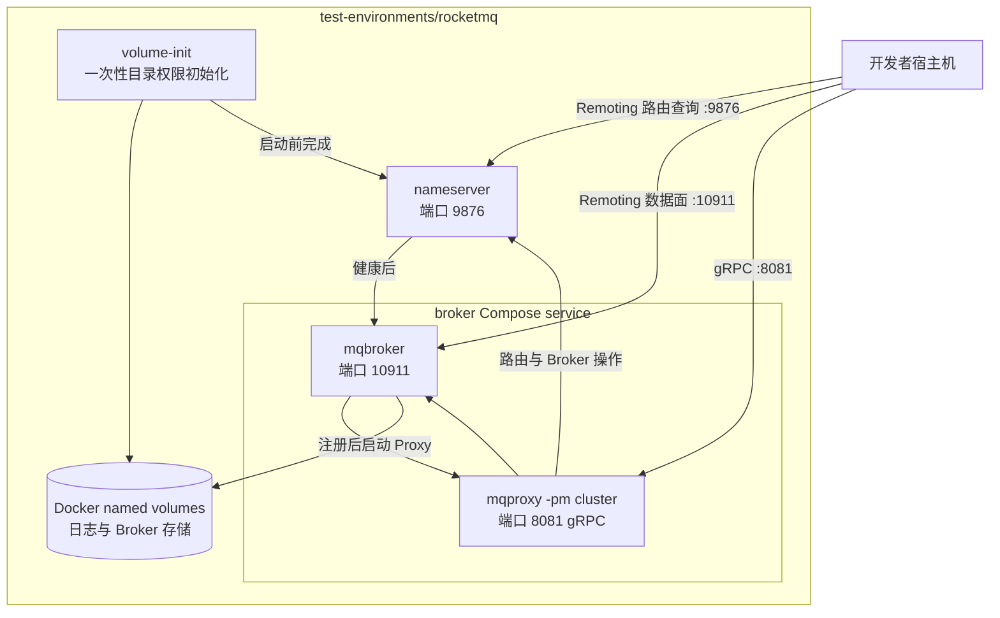

# 测试环境

[English](README.md) | [简体中文](README.zh-CN.md)

此目录集中存放供人工本地测试使用的 Docker Compose 环境。每个一级子目录都是一套自包含环境，拥有自己的
Compose 文件、配置和使用说明。新增环境时应新建子目录，不应把无关服务混入已有环境。

## 当前拓扑

当前的 `rocketmq` 环境是一套支持 LitePush 的单 Broker 开发环境。Broker 与 Proxy 是 `broker` Compose service
内的两个独立进程；它有意不使用 Broker-integrated Proxy 模式。

| 环境 | 用途 | 说明 |
| --- | --- | --- |
| [`rocketmq`](rocketmq) | 为 sample 和手工客户端测试提供本地 Apache RocketMQ 5.5.0 NameServer、Broker 及独立启动的 cluster-mode Proxy；这是随附支持 LitePush 的环境。 | [README](rocketmq/README.md) |

集成测试使用 Testcontainers，不需要预先启动这些环境。
