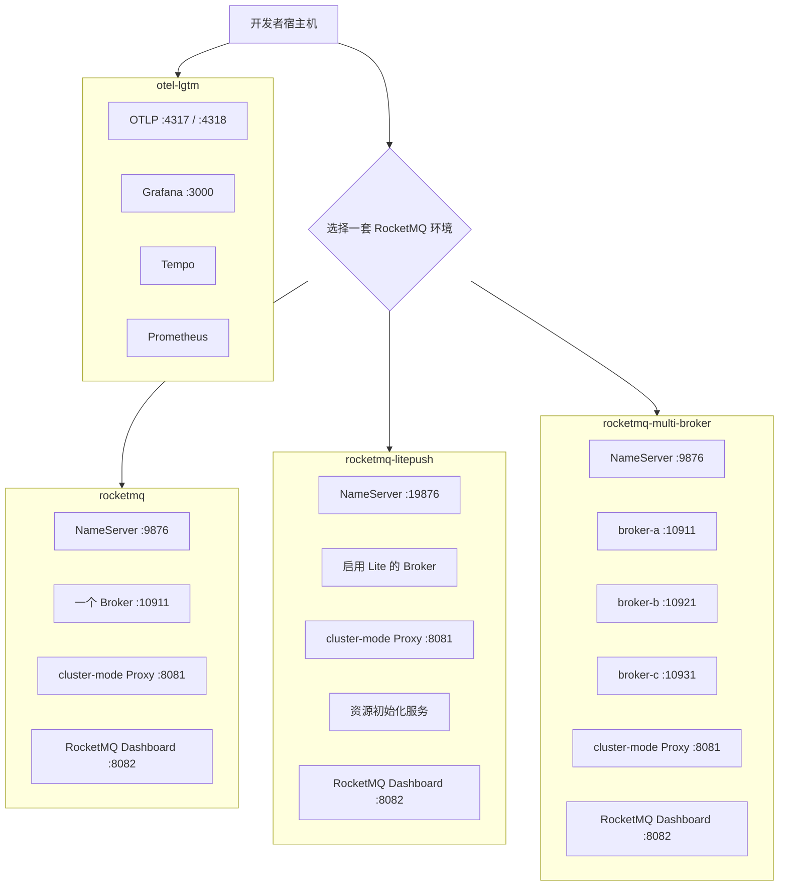

# 测试环境

[English](README.md) | [简体中文](README.zh-CN.md)

此目录存放供手动本地测试使用的 Docker Compose 环境。它们用于开发、验证和排查问题，不是生产部署模板。

每个子目录都是一套独立环境，包含自己的 Compose 文件、配置、持久化覆盖文件和使用说明。新增场景时请新建
子目录，不要把无关服务混入现有环境。

## 选择环境

| 环境 | 适用场景 | 启动内容 | 说明 |
| --- | --- | --- | --- |
| [`rocketmq`](rocketmq) | 运行普通 Remoting 或 gRPC 示例，或排查单 Broker 场景。 | NameServer、一个 Broker、一个 cluster-mode Proxy、RocketMQ Dashboard，以及普通示例 Topic 初始化服务。 | [中文说明](rocketmq/README.zh-CN.md) |
| [`rocketmq-litepush`](rocketmq-litepush) | 直接运行仓库提供的 gRPC LitePush 示例，不想手动创建 RocketMQ 资源。 | NameServer、一个启用 Lite 的 Broker、一个 cluster-mode Proxy、RocketMQ Dashboard，以及自动创建 LITE parent Topic 和 Consumer Group 的初始化服务。 | [中文说明](rocketmq-litepush/README.zh-CN.md) |
| [`rocketmq-multi-broker`](rocketmq-multi-broker) | 检查三个 Broker 间的路由、队列分布或客户端行为。 | NameServer、三个独立 master Broker、一个 cluster-mode Proxy 和 RocketMQ Dashboard。 | [中文说明](rocketmq-multi-broker/README.zh-CN.md) |
| [`otel-lgtm`](otel-lgtm) | 在 Grafana 中查看本地 RocketMQ 客户端 traces 和 metrics。 | 包含 OTLP collector、Grafana、Tempo、Prometheus、Loki 和 Pyroscope 的 Grafana OTEL LGTM。 | [中文说明](otel-lgtm/README.zh-CN.md) |

运行 LitePush 时，优先选择 `rocketmq-litepush`。它的资源初始化服务会随
`docker compose up -d --wait` 一起运行；启动示例前不需要再执行 `mqadmin` 命令。

`rocketmq-multi-broker` 中的三个 Broker 彼此独立。它用于验证路由和分区行为，不用于验证副本同步或高可用。

每套 RocketMQ 环境都会在 `http://localhost:8082` 提供 RocketMQ Dashboard。它是本地管理界面，可以修改 Topic 和
Consumer Group，因此只绑定到 `127.0.0.1`，不能当作生产环境的管理方案。`otel-lgtm` 是纯遥测环境，在
`http://127.0.0.1:3000` 提供 Grafana，并在 `4317` 和 `4318` 端口提供 OTLP。

## 环境总览

所有 RocketMQ 环境在提供 gRPC 时都使用 cluster-mode Proxy。LitePush 尤其依赖这种部署方式，因为 RocketMQ 5.5.0 的
Broker-integrated Proxy 不支持 `SyncLiteSubscription` RPC。纯遥测的 `otel-lgtm` 环境可以与一套 RocketMQ 环境同时运行，
它只接收应用通过 OTLP 发送的数据，不会启动 Broker 或 Proxy。

## 使用规则

- 在所选环境目录中执行 `docker compose`，或使用 `-f` 指定该目录的 `compose.yaml`。
- 不要同时启动三套 RocketMQ 环境。它们都会占用 gRPC Proxy 的 `8081` 和 Dashboard 的 `8082`；单 Broker 和多 Broker
  环境还会占用相同的 NameServer 与 Broker 端口。`otel-lgtm` 使用 `3000`、`4317` 和 `4318`，可与一套 RocketMQ 环境同时运行。
- 需要检查或备份本地文件时，使用对应环境的 `compose.host-volumes.yaml`。各环境的 README 会说明 `data/` 目录和
  重置数据的方式。
- 集成测试不使用这些 Compose 环境。它们会启动隔离的 Testcontainers fixture，因此执行 `dotnet test` 前不需要
  手动启动任何环境。
