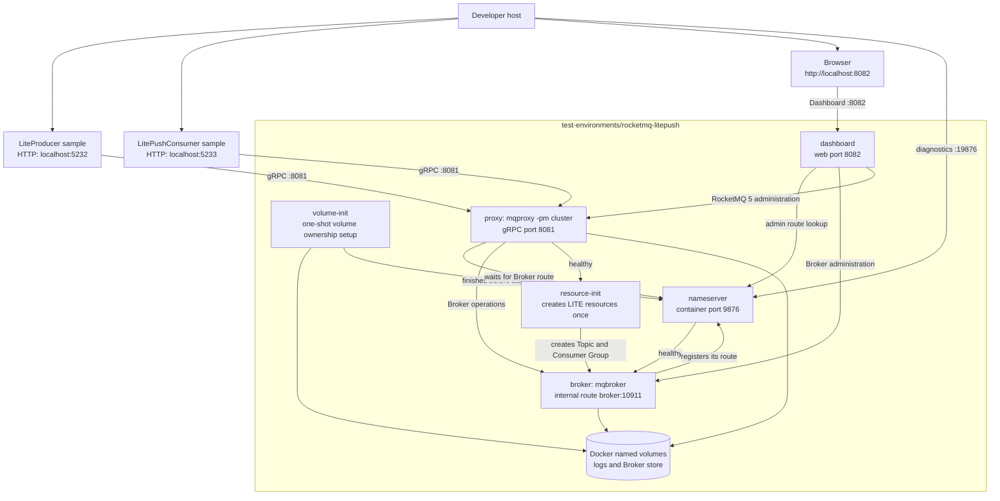

# RocketMQ LitePush test environment

[All test environments](../README.md) | [Simplified Chinese](README.zh-CN.md)

This environment is a self-contained Apache RocketMQ 5.5.0 stack for the repository's gRPC
[`LiteProducer`](../../samples/grpc/GenericHost/LiteProducer/README.md) and
[`LitePushConsumer`](../../samples/grpc/GenericHost/LitePushConsumer/README.md) samples.

Run `docker compose up -d --wait` once. The stack starts a cluster-mode Proxy and automatically prepares the
resources required by the sample; no `mqadmin` command is needed from the developer.

It deliberately exposes the sample's default gRPC endpoint, `localhost:8081`. The NameServer diagnostic port is
`localhost:19876`, so it does not conflict with the default single- or multi-Broker NameServer port.

RocketMQ Dashboard is available at `http://localhost:8082`. Its browser endpoint is separate from the gRPC Proxy
endpoint.

## Automatically prepared resources

The one-shot `resource-init` service waits for the Broker and cluster-mode Proxy health checks to pass. It then
creates or updates the following idempotently:

| Resource | Name | Required setting |
| --- | --- | --- |
| LITE parent Topic | `eventhorizon-test-lite-parent-topic` | `message.type=LITE` |
| Consumer Group | `eventhorizon-test-lite-push-consumer` | `lite.bind.topic=eventhorizon-test-lite-parent-topic` |

LiteTopics are logical children of the LITE parent Topic, not independent ordinary Topics that `resource-init` creates.
The LitePushConsumer sample intentionally starts with none, then its HTTP API synchronizes current names through
`IGrpcLitePushConsumer.SubscribeLiteAsync` and `UnsubscribeLiteAsync` at runtime.

The Broker enables `enableLmq=true` and `enableMultiDispatch=true`. The Proxy starts separately with
`mqproxy -pm cluster`; RocketMQ 5.5.0's Broker-integrated Proxy does not provide `SyncLiteSubscription`.

## Topology



The Broker advertises the Compose-network address `broker:10911`. It is intentionally not a host-reachable Remoting
endpoint; this environment is for gRPC LitePush.

## Start

Run the following from this directory:

The first run also pulls `apacherocketmq/rocketmq-dashboard:2.1.0` when it is not already available locally.

```shell
docker compose up -d --wait
docker compose ps --all
```

`resource-init` should show `Exited (0)`. That completed state is expected, and `--wait` does not return until its
resource setup has finished successfully.

Open [RocketMQ Dashboard](http://localhost:8082) to inspect the cluster and automatically prepared resources.
Dashboard can change Topics and Consumer Groups, so use it only as a local development tool.

To inspect the automatic setup without issuing any administration commands, read its log:

```shell
docker compose logs --no-color resource-init
```

Run the two cooperating samples from the repository root without changing their default `appsettings.json` files.
Start the Consumer in one terminal:

```shell
dotnet run --project samples/grpc/GenericHost/LitePushConsumer
```

With the Consumer running, add a runtime subscription in another terminal. LiteTopic names use only letters, digits,
hyphens, and underscores:

```shell
curl --request POST http://localhost:5233/subscriptions/chat-session-123
curl http://localhost:5233/subscriptions
```

Start LiteProducer in a third terminal, then post a message to that same LiteTopic from a fourth terminal:

```shell
dotnet run --project samples/grpc/GenericHost/LiteProducer
```

```shell
curl --request POST http://localhost:5232/messages \
  --header 'Content-Type: application/json' \
  --data '{"liteTopic":"chat-session-123","message":"hello Lite"}'
```

LiteProducer sends a Lite message under `eventhorizon-test-lite-parent-topic` with the requested LiteTopic, so it
becomes eligible for the current subscription. The standard Producer sample sends ordinary messages and therefore does
not populate a LiteTopic. Both Lite samples run in a Generic Host, which owns their Producer or Consumer `StartAsync`
and `StopAsync` lifecycle. Runtime subscriptions belong to the Consumer process, so recreate them after it restarts.

## Endpoints and limits

| Purpose | Host endpoint | Notes |
| --- | --- | --- |
| gRPC Lite samples | `localhost:8081` | The default `RocketMQ:Client:Endpoint`. |
| LitePushConsumer HTTP API | `http://localhost:5233/subscriptions` | `POST` or `DELETE /{liteTopic}` changes runtime subscriptions; `GET` returns the local snapshot. |
| LiteProducer HTTP API | `http://localhost:5232/messages` | `POST` JSON such as `{"liteTopic":"chat-session-123","message":"hello Lite"}`. |
| NameServer diagnostics | `localhost:19876` | Optional inspection endpoint, not the gRPC client endpoint. |
| RocketMQ Dashboard | `http://localhost:8082` | Local management interface for the cluster. |
| Broker | Not published | Reachable only as `broker:10911` inside the Compose network. |

- Docker Compose must be available. The first run pulls `apache/rocketmq:5.5.0` and
  `apacherocketmq/rocketmq-dashboard:2.1.0` when necessary.
- This environment cannot run at the same time as an environment that publishes host port `8081`, including
  `rocketmq` and `rocketmq-multi-broker`.
- All published ports bind to `127.0.0.1`; the stack is intended only for local development.
- Dashboard can modify RocketMQ resources and has no production authentication or exposure configuration in this stack.
- Do not configure a classic Remoting client with this environment's NameServer. The Broker route is deliberately
  internal to Docker and is not reachable by a host Remoting client.

## Persistence and reset

By default, NameServer logs, Broker logs and store files, and Proxy logs use Docker named volumes. `docker compose
down` stops the stack without removing those data.

Use the following command for a clean state. The next `up -d --wait` run recreates the LITE parent Topic and Consumer
Group automatically.

```shell
docker compose down -v --remove-orphans
```

To store data below this directory instead, use the host-volume override:

```shell
docker compose -f compose.yaml -f compose.host-volumes.yaml up -d --wait
```

It writes data under `./data/`. Keep using both Compose files for later commands. `docker compose down -v` does not
remove bind-mounted host data; remove `./data` explicitly when a full host-directory reset is required.

## Stop

Stop services while retaining the default named volumes:

```shell
docker compose down
```

For the protocol constraints behind this environment, see the
[gRPC guide](../../src/EventHorizon.RocketMQ.Grpc/README.md) and the
[RocketMQ architecture note](../../docs/en-US/architecture/rocketmq-architecture.md).
