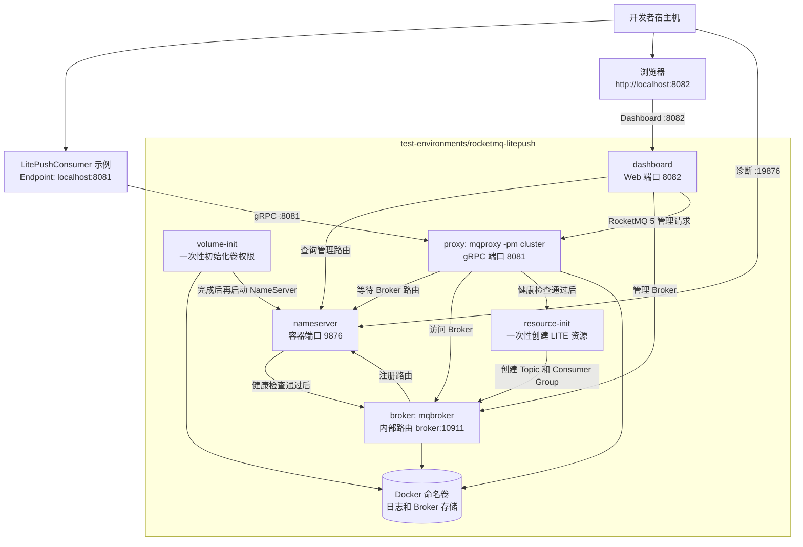

# RocketMQ LitePush 测试环境

[全部测试环境](../README.zh-CN.md) | [English](README.md)

这套环境专门用于运行仓库中的 gRPC
[`LitePushConsumer` 示例](../../samples/grpc/LitePushConsumer/README.zh-CN.md)。它使用 Apache RocketMQ 5.5.0。

只需执行一次 `docker compose up -d --wait`。环境会启动 cluster-mode Proxy，并自动准备示例所需的资源；开发者不需要
手动执行 `mqadmin` 命令。

环境对外暴露的 gRPC 端点与示例默认值一致，为 `localhost:8081`。NameServer 的诊断端口使用 `localhost:19876`，不会与单 Broker 或多
Broker 环境默认使用的 NameServer 端口冲突。

RocketMQ Dashboard 的访问地址为 `http://localhost:8082`。它的浏览器访问地址与 gRPC Proxy 端点不同。

## 自动准备的资源

一次性 `resource-init` 服务会等待 Broker 和 cluster-mode Proxy 的健康检查通过，再以幂等方式创建或更新下列资源：

| 资源 | 名称 | 必需设置 |
| --- | --- | --- |
| LITE parent Topic | `rocketmq-dotnet-lite-manual` | `message.type=LITE` |
| Consumer Group | `rocketmq-dotnet-grpc-lite-push-sample` | `lite.bind.topic=rocketmq-dotnet-lite-manual` |
| 示例使用的 LiteTopic | `rocketmq-dotnet-lite-sample` | 示例启动时由 `IGrpcLitePushConsumer` 通过 `SyncLiteSubscription` 同步。 |

`rocketmq-dotnet-lite-sample` 是 LITE parent Topic 下的逻辑 LiteTopic，并不是 `resource-init` 需要创建的独立普通
Topic。

Broker 已启用 `enableLmq=true` 和 `enableMultiDispatch=true`。Proxy 作为独立进程以 `mqproxy -pm cluster` 启动；
RocketMQ 5.5.0 的 Broker-integrated Proxy 不支持 `SyncLiteSubscription` RPC。

## 拓扑



Broker 对外公布的是 Compose 网络内的 `broker:10911`。这个地址刻意不让宿主机上的 Remoting 客户端访问，因为这套
环境只用于 gRPC LitePush。

## 启动

在本目录执行：

如果本机尚未缓存 RocketMQ Dashboard 镜像，首次运行会额外拉取 `apacherocketmq/rocketmq-dashboard:2.1.0`。

```shell
docker compose up -d --wait
docker compose ps --all
```

`resource-init` 应显示为 `Exited (0)`。这是一次性初始化完成后的正常状态，`--wait` 会等待资源创建成功后才返回。

访问 [RocketMQ Dashboard](http://localhost:8082) 可以查看集群和自动创建的资源。Dashboard 能修改 Topic 和
Consumer Group，因此只应将它用作本地开发工具。

无需执行任何管理命令；可通过以下日志确认自动初始化结果：

```shell
docker compose logs --no-color resource-init
```

随后在仓库根目录运行示例即可，默认的 `appsettings.json` 不需要修改：

```shell
dotnet run --project samples/grpc/LitePushConsumer
```

Consumer 启动时会同步 `rocketmq-dotnet-lite-sample`。要收到消息，需要使用支持 Lite message 的 gRPC Producer 向
`rocketmq-dotnet-lite-manual` 发送 Lite message，并指定该 LiteTopic；标准 Producer 示例发送的是普通消息，不会
写入 LiteTopic。

## 端点与限制

| 用途 | 宿主机端点 | 说明 |
| --- | --- | --- |
| gRPC LitePush 示例 | `localhost:8081` | 默认的 `RocketMQ:Client:Endpoint`。 |
| NameServer 诊断 | `localhost:19876` | 可选的检查端点，不是 gRPC 客户端端点。 |
| RocketMQ Dashboard | `http://localhost:8082` | 集群的本地管理界面。 |
| Broker | 不公开 | 仅能在 Compose 网络内通过 `broker:10911` 访问。 |

- 本机需要可用的 Docker Compose。首次运行会在需要时拉取 `apache/rocketmq:5.5.0` 和
  `apacherocketmq/rocketmq-dashboard:2.1.0`。
- 这套环境不能与任何占用宿主机 `8081` 端口的环境同时运行，其中包括 `rocketmq` 和
  `rocketmq-multi-broker`。
- 所有公开端口都绑定到 `127.0.0.1`，只适合本地开发。
- Dashboard 可以修改 RocketMQ 资源；这套环境未配置生产环境所需的认证或对外暴露方式。
- 不要把这套环境的 NameServer 配置给 classic Remoting 客户端。Broker 路由刻意只在 Docker 网络内可达，宿主机上的
  Remoting 客户端无法直连。

## 持久化与重置

默认情况下，NameServer 日志、Broker 日志和存储文件、Proxy 日志都保存在 Docker 命名卷中。执行 `docker compose
down` 只会停止服务，不会删除这些数据。

如需回到干净状态，请执行下面的命令。下一次 `up -d --wait` 会再次自动创建 LITE parent Topic 和 Consumer Group。

```shell
docker compose down -v --remove-orphans
```

若要把数据直接保存在当前目录下，可叠加宿主机卷覆盖文件：

```shell
docker compose -f compose.yaml -f compose.host-volumes.yaml up -d --wait
```

数据会写入 `./data/`。后续 Compose 命令也要同时传入这两个文件。`docker compose down -v` 不会删除绑定到宿主机的
数据；如需彻底重置，请显式删除 `./data`。

## 停止

停止服务并保留默认命名卷：

```shell
docker compose down
```

有关这套环境依赖的协议限制，请参阅 [gRPC 指南](../../src/EventHorizon.RocketMQ.Grpc/README.zh-CN.md) 和
[RocketMQ 架构说明](../../docs/zh-CN/architecture/rocketmq-architecture.md)。
