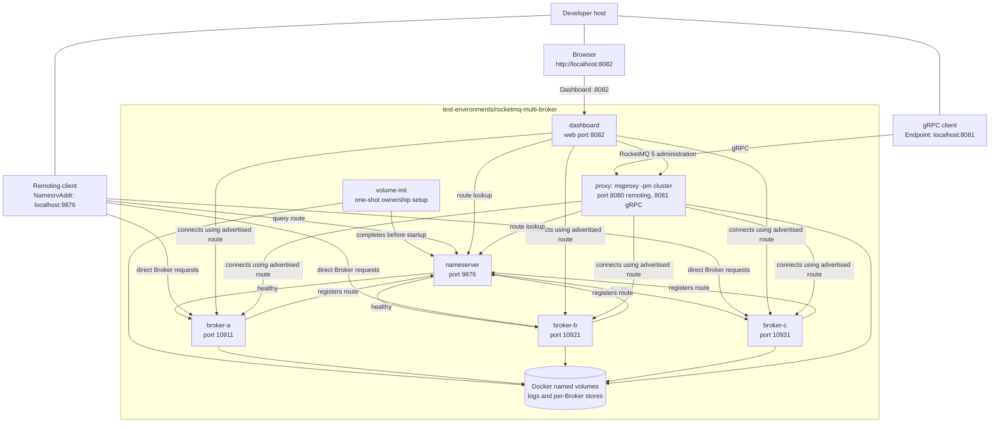

# RocketMQ multi-Broker test environment

[All test environments](../README.md) | [Simplified Chinese](README.zh-CN.md)

This directory defines a local Apache RocketMQ 5.5.0 environment for manual multi-Broker testing. It starts:

- one NameServer on `localhost:9876`;
- three independent asynchronous master Brokers: `broker-a` on port `10911`, `broker-b` on port `10921`, and
  `broker-c` on port `10931`;
- one separately started cluster-mode Proxy on `localhost:8080` (remoting) and `localhost:8081` (gRPC).
- RocketMQ Dashboard on `http://localhost:8082`.

This is a three-master route and partitioning environment, not a high-availability topology.

The Brokers do not replicate each other's data.

Stopping one Broker makes the queues and messages owned by that Broker unavailable.

Unlike the single-Broker [`rocketmq`](../rocketmq) environment, the Proxy is its own Compose service.

All three Brokers advertise a host-reachable address. The Proxy can therefore operate across their routes, and a
classic Remoting client on the host can connect directly to any Broker returned by the NameServer.

Dashboard uses the same advertised routes as the Proxy. It is configured with the same Docker host-gateway alias,
so the default address works on Docker Desktop and OrbStack.

For the component roles, protocol paths, and why a Remoting client needs every advertised Broker address, see the
[RocketMQ architecture note](../../docs/en-US/architecture/rocketmq-architecture.md).

## Topology



## Start and inspect

Run the commands from this directory, or pass
`-f test-environments/rocketmq-multi-broker/compose.yaml` from the repository root.

Docker Desktop and OrbStack normally support the default advertised address, `host.docker.internal`:

The first run also pulls `apacherocketmq/rocketmq-dashboard:2.1.0` when it is not already available locally.

```shell
docker compose config --quiet
docker compose up -d --wait
docker compose ps
```

Confirm that all three Brokers registered with the NameServer:

```shell
docker compose exec proxy sh mqadmin clusterList -n nameserver:9876
```

The output should contain `broker-a`, `broker-b`, and `broker-c`.

Open [RocketMQ Dashboard](http://localhost:8082) to inspect the cluster, routes, Topics, Consumer Groups, and
messages. Dashboard can modify RocketMQ resources, so use it only as a local development tool.

## Advertised Broker address

Compose renders `ROCKETMQ_ADVERTISED_HOST` into `brokerIP1` for all three Brokers.

That address must be reachable from:

- the host process that runs a classic Remoting client;
- the `proxy` container, which resolves the routes returned by the NameServer.

The default, `host.docker.internal`, is appropriate for Docker Desktop and OrbStack.

The Compose services add a Docker host-gateway alias so the Proxy can use that name too.

Dashboard uses the same alias and has the same route-reachability requirement.

On a Linux host:

- `host.docker.internal` may resolve inside containers but not from the host process.
- Choose an IP address or hostname that is reachable from both sides.
- Export the selected value before starting the environment.

```shell
export ROCKETMQ_ADVERTISED_HOST=192.0.2.10
docker compose up -d --wait
```

Replace `192.0.2.10` with a real host address.

- Do not use `localhost` or `127.0.0.1`: from the separate Proxy container, either value refers to the Proxy
  container itself rather than a Broker.
- Restart the environment after changing this value so all three Brokers re-register their routes.

## Client endpoints and ports

| Purpose | Host endpoint | Notes |
| --- | --- | --- |
| Classic Remoting route lookup | NameServer `localhost:9876` | Configure this as `NamesrvAddr`. The client then uses the Broker routes returned by NameServer. |
| Classic Remoting Broker A | `<advertised-host>:10911` | Returned in topic routes. |
| Classic Remoting Broker B | `<advertised-host>:10921` | Returned in topic routes. |
| Classic Remoting Broker C | `<advertised-host>:10931` | Returned in topic routes. |
| RocketMQ 5 gRPC | Proxy `localhost:8081` | Configure this as `Endpoint`. |
| Proxy remoting service | `localhost:8080` | Not the entry point for this repository's classic Remoting client. |
| RocketMQ Dashboard | `http://localhost:8082` | Local management interface for the cluster. |

The fast remoting and HA ports are also published for local inspection: `10909` and `10912` for `broker-a`,
`10919` and `10922` for `broker-b`, then `10929` and `10932` for `broker-c`.

All published ports bind to `127.0.0.1`. This environment is for local testing, not for direct use from another
machine.

Dashboard can modify RocketMQ resources and has no production authentication or exposure configuration in this stack.

## Prepare manual tests

Create a Topic on each Broker before testing route discovery or queue distribution. `mqadmin updateTopic -c
DefaultCluster` does not reliably create the Topic on all Brokers, so target each Broker explicitly:

```shell
for broker in broker-a:10911 broker-b:10921 broker-c:10931
do
  docker compose exec proxy sh mqadmin updateTopic \
    -n nameserver:9876 \
    -b "$broker" \
    -t rocketmq-dotnet-multi-broker-manual
done

docker compose exec proxy sh mqadmin topicRoute \
  -n nameserver:9876 -t rocketmq-dotnet-multi-broker-manual
```

All three Brokers set `autoCreateSubscriptionGroup=true`. A standard Consumer Group is therefore created on first
use. If you disable that setting or need explicit Group attributes, apply `mqadmin updateSubGroup -b` to each Broker
in the same way.

### LitePush

LitePush is supported by this environment because:

- every Broker enables `enableLmq=true` and `enableMultiDispatch=true`;
- the Proxy runs independently with `mqproxy -pm cluster`.

The independent cluster-mode Proxy is required. RocketMQ 5.5.0's Broker-integrated Proxy does not implement
`SyncLiteSubscription`.

For the bundled LitePush sample without manual resource setup, use the dedicated
[`rocketmq-litepush`](../rocketmq-litepush) environment. The commands below are for testing LitePush across all
three Brokers.

Create the LITE parent Topic and its Consumer Group on each Broker before starting a LitePush sample:

```shell
for broker in broker-a:10911 broker-b:10921 broker-c:10931
do
  docker compose exec proxy sh mqadmin updateTopic \
    -n nameserver:9876 \
    -b "$broker" \
    -t rocketmq-dotnet-multi-broker-lite-manual \
    -a +message.type=LITE

  docker compose exec proxy sh mqadmin updateSubGroup \
    -n nameserver:9876 \
    -b "$broker" \
    -g rocketmq-dotnet-grpc-lite-push-sample \
    --attributes +lite.bind.topic=rocketmq-dotnet-multi-broker-lite-manual
done
```

The LITE parent topic is created across all three masters.

Keep the group bind topic aligned with the topic used by the Lite producer and consumer.

## Persistence

The default configuration uses Docker named volumes for NameServer logs, Proxy logs, and each Broker's logs and
message store.

`docker compose down` keeps those volumes. The following command removes the stack and all named-volume data:

```shell
docker compose down -v --remove-orphans
```

To inspect or back up files directly from the repository, use the host-volume override:

```shell
docker compose -f compose.yaml -f compose.host-volumes.yaml up -d --wait
```

The override stores data under `./data/` in separate directories for NameServer, Proxy, `broker-a`, `broker-b`, and
`broker-c`.

- `volume-init` creates the directories and assigns them to the image's non-root RocketMQ user.
- The `data/` directory is ignored by Git.
- `docker compose down -v` does not delete bind-mounted host data. Remove `./data` explicitly for a full reset.

Use the same two `-f` arguments for subsequent Compose commands.

## Stop

Stop services while retaining their data:

```shell
docker compose down
```

Use the named-volume reset command in the preceding section when a clean cluster is required.
