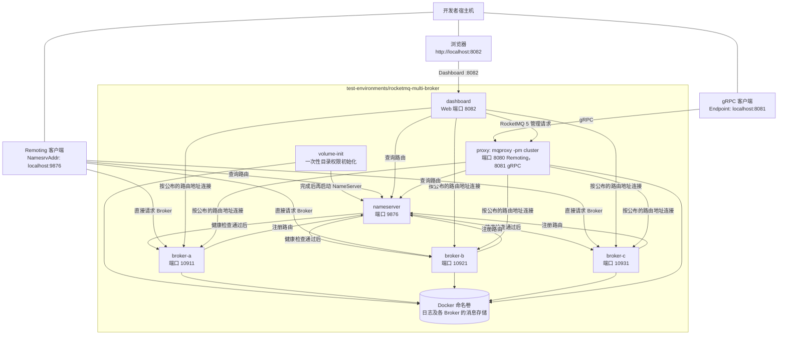

# RocketMQ 多 Broker 测试环境

[全部测试环境](../README.zh-CN.md) | [English](README.md)

这里提供一套用于手动本地测试的 Apache RocketMQ 5.5.0 三 Broker 环境，其中包括：

- 一个 NameServer，地址为 `localhost:9876`；
- 三个彼此独立的异步 master Broker：`broker-a` 为 `localhost:10911`，`broker-b` 为 `localhost:10921`，`broker-c` 为 `localhost:10931`；
- 一个单独运行的 cluster-mode Proxy：`localhost:8080` 提供 Remoting，`localhost:8081` 提供 gRPC。
- 一个 RocketMQ Dashboard，访问地址为 `http://localhost:8082`。

这套环境用于验证多 Broker 路由和分区行为，不是高可用部署。
每台 Broker 默认每个 Topic 使用三个队列。资源初始化服务还会在每台 Broker 上为普通 Topic 和 LITE parent Topic
显式创建三个可读队列及三个可写队列，因此完整路由包含九个物理队列。

三个 Broker 之间没有副本同步。

停止其中一个 Broker 后，由该 Broker 承载的队列和消息将不可用。

与单 Broker 的 [`rocketmq`](../rocketmq) 环境不同，这里的 Proxy 是独立的 Compose 服务。

三个 Broker 都会向 NameServer 注册宿主机可达的地址。因此 Proxy 可通过这些路由访问三台 Broker，宿主机上的 classic Remoting
客户端也能直接连接 NameServer 返回的路由中任一 Broker 的地址。

Dashboard 使用与 Proxy 相同的 Broker 公布的路由，并配置了相同的 Docker host-gateway 别名。因此在 Docker Desktop 和
OrbStack 中，默认地址可以直接使用。

有关 NameServer、Broker、Proxy 的职责，以及为什么 Remoting 客户端必须能访问每个已公布的 Broker 地址，请参阅
[RocketMQ 架构说明](../../docs/zh-CN/architecture/rocketmq-architecture.md)。

## 拓扑



## 启动与检查

请在当前目录执行下列命令；如果从仓库根目录执行，则需要显式指定
`-f test-environments/rocketmq-multi-broker/compose.yaml`。

Docker Desktop 和 OrbStack 通常可以直接使用默认的 Broker 公布地址 `host.docker.internal`。

如果本机尚未缓存 RocketMQ Dashboard 镜像，首次运行会额外拉取 `apacherocketmq/rocketmq-dashboard:2.1.0`。

```shell
docker compose config --quiet
docker compose up -d --wait
docker compose ps
```

确认三个 Broker 都已注册到 NameServer：

```shell
docker compose exec proxy sh mqadmin clusterList -n nameserver:9876
```

输出中应同时出现 `broker-a`、`broker-b` 和 `broker-c`。

访问 [RocketMQ Dashboard](http://localhost:8082) 可以查看集群、路由、Topic、Consumer Group 和消息。Dashboard
也能修改 RocketMQ 资源，因此只应将它用作本地开发工具。

## Broker 公布地址

Compose 会把 `ROCKETMQ_ADVERTISED_HOST` 写入三个 Broker 的 `brokerIP1`。

这个地址必须同时能被以下两端访问：

- 运行 classic Remoting 客户端的宿主机进程；
- 根据 NameServer 路由访问 Broker 的 `proxy` 容器。

默认值 `host.docker.internal` 适用于 Docker Desktop 和 OrbStack。

Compose 还为各服务添加了 Docker 的 host-gateway 别名，使 Proxy 也能通过这个名称访问宿主机。

Dashboard 使用相同别名，对 Broker 路由的可达性要求也与 Proxy 相同。

在 Linux 上：

- `host.docker.internal` 可能只在容器内可解析，宿主机进程却无法解析。
- 请选用一个容器和宿主机都能访问的主机 IP 或域名。
- 启动环境前设置该值。

```shell
export ROCKETMQ_ADVERTISED_HOST=192.0.2.10
docker compose up -d --wait
```

请把 `192.0.2.10` 换成实际可用的主机地址。

- 不要填写 `localhost` 或 `127.0.0.1`：对于独立的 Proxy 容器，这两个地址指向的是 Proxy 容器自身，而不是
  任意一个 Broker。
- 修改该变量后需要重启环境，让三个 Broker 重新注册路由。

## 客户端端点与端口

| 用途 | 宿主机端点 | 说明 |
| --- | --- | --- |
| classic Remoting 路由查询 | NameServer `localhost:9876` | 配置为 `NamesrvAddr`；客户端随后会使用 NameServer 返回的 Broker 路由。 |
| classic Remoting Broker A | `<公布地址>:10911` | 会出现在 Topic 路由中。 |
| classic Remoting Broker B | `<公布地址>:10921` | 会出现在 Topic 路由中。 |
| classic Remoting Broker C | `<公布地址>:10931` | 会出现在 Topic 路由中。 |
| RocketMQ 5 gRPC | Proxy `localhost:8081` | 配置为 `Endpoint`。 |
| Proxy Remoting 服务 | `localhost:8080` | 不是本仓库 classic Remoting 客户端的入口。 |
| RocketMQ Dashboard | `http://localhost:8082` | 集群的本地管理界面。 |

为了便于本地检查，环境还公布了 fast remoting 和 HA 端口：`broker-a` 使用 `10909`、`10912`，`broker-b` 使用
`10919`、`10922`，`broker-c` 使用 `10929`、`10932`。

所有公布端口都绑定到 `127.0.0.1`，仅适合本机测试，不能直接供其他机器访问。

Dashboard 可以修改 RocketMQ 资源；这套环境未配置生产环境所需的认证或对外暴露方式。

## 准备测试资源

测试路由发现或队列分布前，应在每台 Broker 上创建同一个 Topic。`mqadmin updateTopic -c DefaultCluster` 不能保证
在三台 Broker 上都创建 Topic，因此请显式指定每台 Broker：

```shell
for broker in broker-a:10911 broker-b:10921 broker-c:10931
do
  docker compose exec proxy sh mqadmin updateTopic \
    -n nameserver:9876 \
    -b "$broker" \
    -t rocketmq-dotnet-multi-broker-manual \
    -r 3 \
    -w 3
done

docker compose exec proxy sh mqadmin topicRoute \
  -n nameserver:9876 -t rocketmq-dotnet-multi-broker-manual
```

路由中每台 Broker 都应包含三个可读及可写队列，总计九个物理队列。

三个 Broker 都设置了 `autoCreateSubscriptionGroup=true`，标准 Consumer Group 会在首次使用时自动创建。
如果关闭该配置，或需要显式配置 Group 属性，请以同样方式对每台 Broker 执行 `mqadmin updateSubGroup -b`。

### LitePush

这套环境支持 LitePush，原因如下：

- 三个 Broker 都开启了 `enableLmq=true` 和 `enableMultiDispatch=true`。
- Proxy 通过独立的 `mqproxy -pm cluster` 进程运行。

独立的 cluster-mode Proxy 不可省略。RocketMQ 5.5.0 的 Broker-integrated Proxy 不支持
`SyncLiteSubscription` RPC。

如需直接运行仓库提供的 LitePush 示例且不手动创建资源，请使用专用的
[`rocketmq-litepush`](../rocketmq-litepush) 环境。以下命令用于在三台 Broker 上手动验证 LitePush。

启动 LitePush 示例之前，请在每台 Broker 上创建 LITE parent Topic，并配置对应 Consumer Group：

```shell
for broker in broker-a:10911 broker-b:10921 broker-c:10931
do
  docker compose exec proxy sh mqadmin updateTopic \
    -n nameserver:9876 \
    -b "$broker" \
    -t rocketmq-dotnet-multi-broker-lite-manual \
    -r 3 \
    -w 3 \
    -a +message.type=LITE

  docker compose exec proxy sh mqadmin updateSubGroup \
    -n nameserver:9876 \
    -b "$broker" \
    -g eventhorizon-test-lite-push-consumer \
    --attributes +lite.bind.topic=rocketmq-dotnet-multi-broker-lite-manual
done
```

这个 LITE 父 Topic 会创建在三个主 Broker 上。

Lite Producer 和 LitePush Consumer 使用的 Topic，必须与 Consumer Group 的绑定 Topic 保持一致。

## 数据持久化

默认配置使用 Docker 命名卷保存 NameServer、Proxy 日志，以及每个 Broker 的日志和消息存储。

执行 `docker compose down` 不会删除这些数据。执行以下命令才会同时移除服务和全部命名卷：

```shell
docker compose down -v --remove-orphans
```

若希望直接检查或备份仓库目录中的文件，可使用宿主机目录覆盖配置：

```shell
docker compose -f compose.yaml -f compose.host-volumes.yaml up -d --wait
```

覆盖配置会把数据写入 `./data/`，并按 NameServer、Proxy、`broker-a`、`broker-b`、`broker-c` 分开存放。

- `volume-init` 会创建这些目录，并把所有权交给镜像中非 root 的 RocketMQ 用户。
- `data/` 目录已被 Git 忽略。
- 使用宿主机目录时，`docker compose down -v` 不会删除其中的数据；需要彻底重置时请自行删除 `./data`。

后续所有 Compose 命令都应继续带上这两个 `-f` 参数。

## 停止

停止服务但保留数据：

```shell
docker compose down
```

需要全新的集群时，请使用上一节中的命名卷清理命令。
